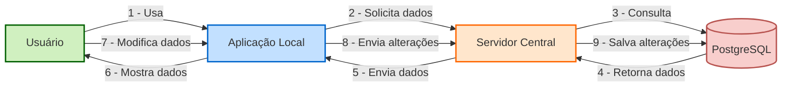

# Cliente MAUI - Sistema de Sincronização de Dados
## Visão Geral
Esta aplicação cliente implementa um sistema de sincronização de dados entre um banco de dados local SQLite e um servidor central PostgreSQL. Desenvolvida com .NET MAUI, a aplicação permite trabalhar offline e sincronizar dados quando a conexão com a internet estiver disponível.

## Funcionalidades
- **Sincronização Bidirecional**: Baixe dados do servidor e envie alterações locais
- **Trabalho Offline**: Acesse e modifique dados mesmo sem conexão
- **Comparativo de Performance**: Compare gRPC vs REST para transferência de dados
- **Paginação**: Navegue por grandes conjuntos de dados de forma eficiente
- **Randomização de Dados**: Gere dados aleatórios para testes de performance

## Tecnologias Utilizadas
- **.NET MAUI**: Framework para desenvolvimento multiplataforma
- **SQLite**: Banco de dados local
- **gRPC**: Comunicação eficiente baseada em HTTP/2
- **REST**: API HTTP tradicional para comparação
- **MVVM**: Padrão de arquitetura para separação de responsabilidades

## Estrutura do Projeto
```
PersonGrpcClient/
├── Models/
│   └── Person.cs                # Modelo de dados principal
├── Services/
│   ├── DatabaseService.cs       # Gerencia operações no SQLite
│   ├── GrpcClientService.cs     # Cliente gRPC
│   └── RestClientService.cs     # Cliente REST
├── ViewModels/
│   └── MainPageViewModel.cs     # Implementação MVVM
├── Views/
│   └── MainPage.xaml            # Interface de usuário
└── Protos/
└── person.proto             # Definição do serviço gRPC
```

## Como Executar
1. Certifique-se de ter o .NET MAUI SDK instalado
2. Clone o repositório
3. Configure o endereço do servidor em GrpcClientService.cs e RestClientService.cs
4. Execute o projeto:
```bash
$ dotnet build
$ dotnet run
```
# Principais Operações


|Operação |	Descrição |
|---------|-----------|
|**Sync All (gRPC)**|	Baixa todos os dados do servidor via gRPC|
|**Sync All (REST)**|	Baixa todos os dados do servidor via REST|
|**Randomize**|	Modifica dados locais aleatoriamente para testes|
|**Sync Changes (gRPC)**|	Envia alterações locais para o servidor via gRPC|
|**Sync Changes (REST)**|	Envia alterações locais para o servidor via REST|
|**Clear Data**|	Limpa todos os dados locais|

## Métricas de Performance
A aplicação exibe métricas detalhadas para cada operação:
- Tempo total de execução
- Tempo médio por registro
- Throughput (registros por segundo)
- Comparativo entre gRPC e REST
